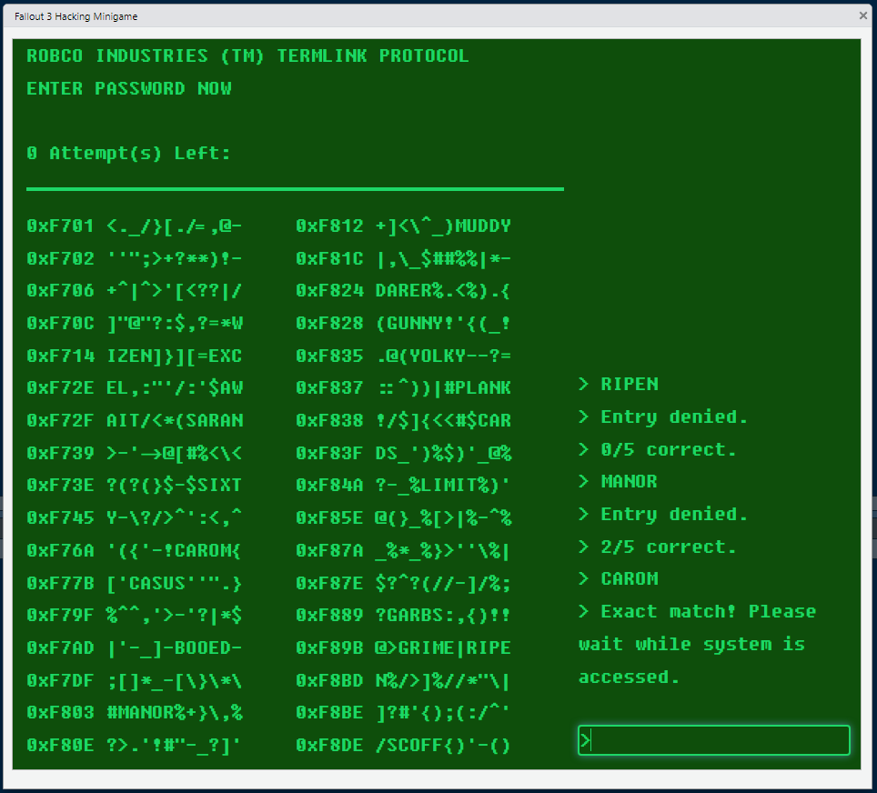

# Fallout 3 Hacking Mini Game

The computer hacking minigame from [Fallout 3](https://en.wikipedia.org/wiki/Fallout_3) created by Bethesda Game Studios, here recreated in [R Shiny](https://www.rstudio.com/products/shiny/).

## Acknowledgements

- The sample dictionary `sgb-words.txt` I used to build the game is from [Professor Donald Knuth of Stanford University](https://www-cs-faculty.stanford.edu/~knuth/).
- The font used is [Fixedsys Excelsior](https://github.com/kika/fixedsys) -- essential for recreating the look and feel of the original.